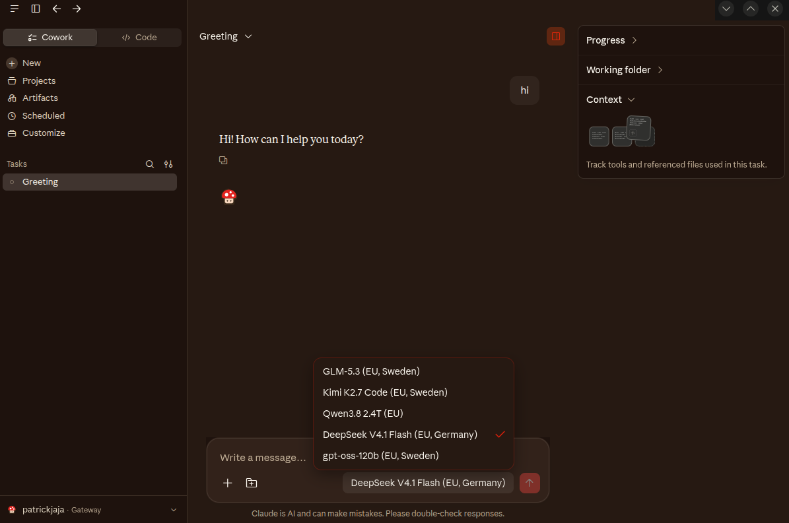
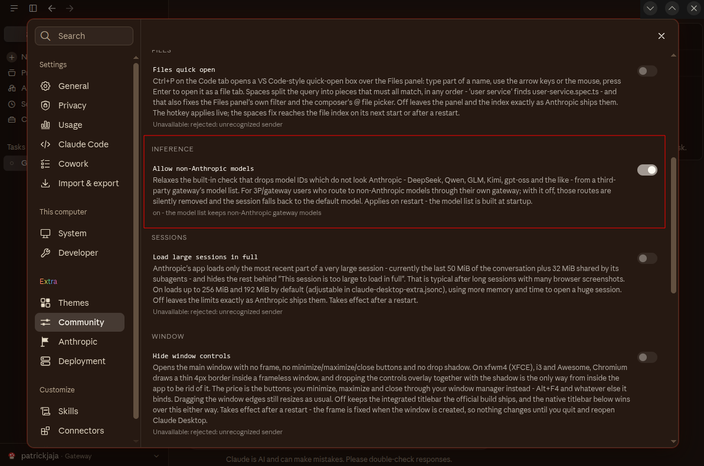

# Non-Anthropic models via Opper (EU gateway)

Run open-weight models such as GLM, Kimi, Qwen, DeepSeek and gpt-oss inside Claude Desktop's Chat, Cowork and Code tabs, routed through [Opper](https://opper.ai), an EU-hosted AI gateway with an Anthropic-compatible Messages API.



## What you get

Claude Desktop's third-party inference mode can point at any gateway that speaks the Anthropic Messages API. Out of the box, though, Anthropic's own bundle checks every gateway model ID by name: IDs that look like another model family (`deepseek`, `qwen`, `glm`, `kimi`, `moonshot`, `gpt`, ...) or that do not name an Anthropic family (`sonnet`, `opus`, `haiku`, ...) are dropped from the Setup model list and the picker, and a session that asks for one falls back to the default model without an error.

This package adds an opt-in switch, **Allow non-Anthropic models**, that relaxes exactly that gateway name check. HIPAA restrictions and an admin's model allowlist still apply. Combined with Opper's EU routes, the prompt and response stay with providers that run inference in the EU, and Opper itself is hosted in Stockholm.

## Prerequisites

- Claude Desktop from this package (any distro), started at least once.
- An Opper account and API key (step 1).
- `curl` for the sanity check.

## 1. Opper account and API key

1. Sign up at [platform.opper.ai](https://platform.opper.ai) (a free sign-up without a credit card is offered at [opper.ai/sign-up/free](https://opper.ai/sign-up/free)).
2. Create an API key under **Settings -> API keys** ([platform.opper.ai/settings/api-keys](https://platform.opper.ai/settings/api-keys)). Keys are scoped to a project, so a separate project for Claude Desktop keeps its usage apart.
3. Pick your model IDs. Opper addresses a model as `provider/model`, and the provider prefix decides where it runs:
   - [opper.ai/models](https://opper.ai/models) - the full catalog with price, context window and region.
   - [opper.ai/models/eu](https://opper.ai/models/eu) - only EU-hosted routes (also as [JSON](https://opper.ai/models/eu.json)).
   - Without a key, from the terminal:
     ```bash
     curl -s "https://api.opper.ai/v3/models?type=llm&inference_location=EU&storage_location=EU&limit=0"
     ```

   Use the full route ID (for example `melious/deepseek-v4.1-flash`), not a bare model name: a bare name is a pool that can mix EU and non-EU routes. See Opper's [EU data residency](https://docs.opper.ai/control-plane/eu-data-residency) page for org-wide enforcement.

The routes used in this recipe, all listed in Opper's EU catalog:

| Route ID | Model |
|---|---|
| `inceptron/zai-org/GLM-5.3` | GLM-5.3 |
| `inceptron/moonshotai/Kimi-K2.7-Code` | Kimi K2.7 Code |
| `tensorx/qwen/qwen3.8-2.4t-a95b` | Qwen3.8 2.4T |
| `melious/deepseek-v4.1-flash` | DeepSeek V4.1 Flash |
| `evroc/gpt-oss-120b` | gpt-oss-120b |

## 2. Sanity check with curl

Confirm the key and a model ID work before touching Claude Desktop:

```bash
export OPPER_API_KEY='<your Opper API key>'

curl -s https://eu.gw.opper.ai/v1/messages \
  -H "Authorization: Bearer $OPPER_API_KEY" \
  -H "anthropic-version: 2023-06-01" \
  -H "content-type: application/json" \
  -d '{
    "model": "melious/deepseek-v4.1-flash",
    "max_tokens": 64,
    "messages": [{"role": "user", "content": "Say hello in one sentence."}]
  }'
```

A working setup returns an Anthropic-shaped message (`"type": "message"`, a `content` array with a `text` block, a `usage` object). A missing or wrong key returns an error that names the `Authorization: Bearer` header.

Opper's docs also list `https://api.opper.ai/v3/compat` as the base URL for its Anthropic-compatible surface ([Drop-in SDKs](https://docs.opper.ai/build/gateway/drop-in-sdks), [Messages API reference](https://docs.opper.ai/v3-api-reference/compatibility/create-message)); this recipe uses `https://eu.gw.opper.ai`.

## 3. Configure the gateway

No `sudo` needed. In Claude Desktop open **Settings -> Extra -> Deployment** (details: [Third-party inference, Route A](../third-party-inference.md#route-a-the-in-app-deployment-panel)):

1. Under *Inference & connection*, set the provider to **gateway**. The gateway fields below appear once it is selected.
2. **Gateway base URL:** `https://eu.gw.opper.ai` (Claude Desktop appends `/v1/messages` itself).
3. **Gateway API key:** your Opper key. It is stored write-only: the panel can replace it but never shows it again.
4. **Gateway auth scheme:** `bearer`.
5. **Model list:** one route ID from step 1 per line; the first is the default. To set the name shown in the picker, write the line as a JSON object instead, e.g. `{"name":"melious/deepseek-v4.1-flash","labelOverride":"DeepSeek V4.1 Flash (EU, Germany)"}`.
6. Flip the mode switch at the top to **3P** and restart when the panel asks.

The panel writes the applied configuration to `~/.config/Claude-3p/configLibrary/<id>.json` (named profile: `~/.config/Claude-<profile>-3p/`), with `configLibrary/_meta.json` pointing at it:

```json
{
  "appliedId": "<id>",
  "entries": [{ "id": "<id>", "name": "Default" }]
}
```

The resulting `<id>.json`, for reference:

```json
{
  "inferenceProvider": "gateway",
  "inferenceGatewayBaseUrl": "https://eu.gw.opper.ai",
  "inferenceGatewayApiKey": "<your Opper API key>",
  "inferenceGatewayAuthScheme": "bearer",
  "inferenceModels": [
    { "name": "inceptron/zai-org/GLM-5.3", "labelOverride": "GLM-5.3 (EU, Sweden)" },
    { "name": "inceptron/moonshotai/Kimi-K2.7-Code", "labelOverride": "Kimi K2.7 Code (EU, Sweden)" },
    { "name": "tensorx/qwen/qwen3.8-2.4t-a95b", "labelOverride": "Qwen3.8 2.4T (EU)" },
    { "name": "melious/deepseek-v4.1-flash", "labelOverride": "DeepSeek V4.1 Flash (EU, Germany)" },
    { "name": "evroc/gpt-oss-120b", "labelOverride": "gpt-oss-120b (EU, Sweden)" }
  ]
}
```

Both files are `0600` in a `0700` directory because they hold the key.

**Switching between your claude.ai account (1P) and Opper (3P):** the mode switch in the Deployment panel, or start with `claude-desktop --1p` / `claude-desktop --3p` (see [command-line flags](../command-line.md)). The Opper configuration stays on disk while you are in 1P.

**Fleet rollout:** the same keys work in `/etc/claude-desktop/managed-settings.json`. That file must be owned by root and not group/world-writable, a single unknown key makes Claude Desktop ignore the whole file, and while it is valid it replaces the per-user configuration. See [Third-party inference, Route C](../third-party-inference.md#route-c-manual-managed-settingsjson). The **Allow non-Anthropic models** switch below is per user either way.

## 4. Turn on "Allow non-Anthropic models" and restart

Open **Settings -> Extra -> Community Features -> Inference** and turn on **Allow non-Anthropic models**, then fully quit and restart Claude Desktop. The model list is built at startup, so the switch has no effect until the restart.



The switch stores `"allowNonAnthropicModels": true` in `~/.config/Claude-3p/claude-desktop-extra.json`. To set it by hand instead, put the same key in `~/.config/Claude-3p/claude-desktop-extra.jsonc`; the `.jsonc` file wins, and the switch then shows as locked. Patch source: [`add_feature_allow_non_anthropic_models.nim`](../../patches/community/add_feature_allow_non_anthropic_models.nim).

## 5. Pick a model

Open a new Chat, Cowork or Code session and choose a model from the picker (screenshot at the top). Each entry shows its `labelOverride`, so putting the region in the label makes it visible where you pick. The choice applies per session.

## Troubleshooting

- **The picker shows only some models, or a session answers as the default model.** The switch is off or Claude Desktop was not restarted after turning it on. Check the patch log:
  ```bash
  grep cdb-models ~/.config/Claude-3p/logs/claude-patches.log | tail -n 3
  ```
  After a restart with the switch on it contains `[cdb-models] installed - non-Anthropic model bypass active`. `... bypass off` means the key is not set (or a `.jsonc` file sets it to `false`).
- **401 / "No API key was sent".** Set the auth scheme to `bearer`, re-enter the key in the Deployment panel, and re-run the curl from step 2 with the same key.
- **A model ID is rejected by Opper.** Copy the exact route ID from [opper.ai/models](https://opper.ai/models); IDs are case-sensitive (`inceptron/zai-org/GLM-5.3`). If your Opper organization has a Model access rule, a route outside it returns `403`.
- **The setup wizard says "Doesn't look like an Anthropic model" and Apply Changes stays disabled.** The wizard reads the switch when its window opens. Turn the switch on, restart, then open Developer -> Configure Third-Party Inference again.
- **Amber "Configuration may need attention" banner.** It lists the models the filter dropped. With the switch on and the app restarted, the models are accepted and the banner goes away.
- **Switch is on, but only in 1P.** The setting is stored per mode. Turned on while in 1P mode, it lands in `~/.config/Claude/` and does not apply to 3P. Switch to 3P first, then turn it on.
- **`main.log` still says `... is not an Anthropic model and was removed from the list`.** This is logged once per model by an early config read at startup that runs before the switch is consulted. It is harmless: the app reads the config again afterwards and keeps the models.
- **Still on your claude.ai account.** The mode is 1P. Use the Deployment panel switch or `claude-desktop --3p` and restart. Logs and settings for 3P live under `~/.config/Claude-3p/`, not `~/.config/Claude/`.
- **Feature quality varies by model.** Claude Desktop's tools, Cowork tasks, Claude Code and Computer Use are built and tuned for Claude models. Non-Anthropic models receive the same requests through Opper's Anthropic-compatible API, but how well they follow tool calls, long agentic loops or screenshots depends on the model and the route (for example, a text-only route cannot read images). Try a task on a model before relying on it, and keep a Claude route in the list as a fallback if you need one.

## See also

- [Third-party inference on Linux](../third-party-inference.md) - every route, key and mode-switching detail.
- [Opper: Claude Code integration](https://docs.opper.ai/integrations/coding-agents/claude-code) and [Integrations overview](https://docs.opper.ai/integrations/overview) - Opper's own setup notes.
