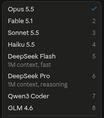
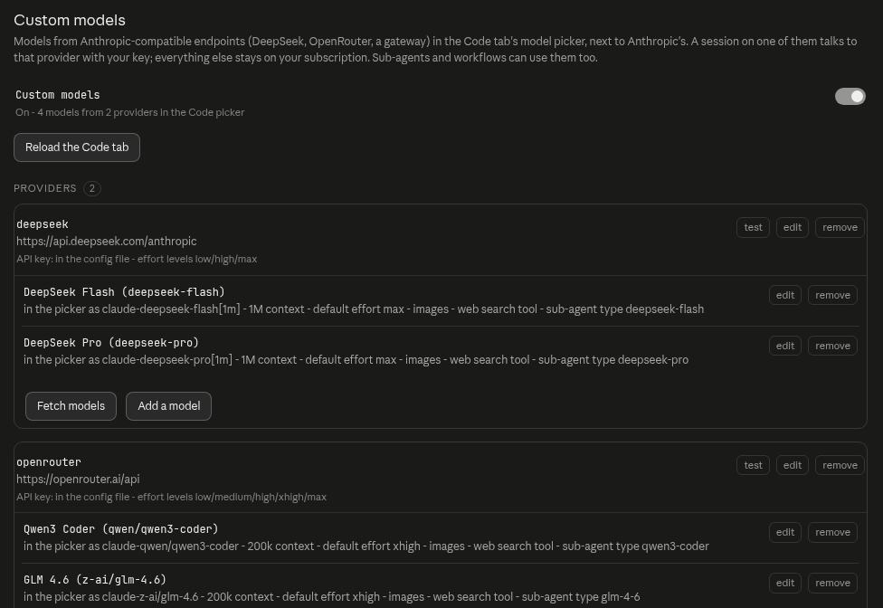

# Custom models

Use models from other providers in the Code tab, next to Anthropic's. Any endpoint that speaks the Anthropic Messages API works: DeepSeek, Kimi, GLM, MiniMax, Qwen, OpenRouter, a gateway such as LiteLLM, or Anthropic's own API on your API credit. A session on a custom model talks to that provider with your key. Everything else stays on your subscription.

This is not [third-party inference](third-party-inference.md), which replaces the subscription with a single gateway. Here the login, the Chat tab and the Claude models stay as they are.



## Setup

1. Open **Settings → Extra → Models** and click **Add a provider**. Pick a preset, or enter an id and the provider's base URL yourself, paste the API key and save.
2. On the provider's card, click **Fetch models** and tick the models you want, or click **Add a model** and type an id.
3. Turn on the **Custom models** switch at the top of the page.
4. Click **Reload the Code tab**. The new models appear in the picker after the Claude models.

**test** on a provider card sends a one-token request with the stored key, so a wrong URL or key shows up there rather than in a session.



The feature is off by default. When it is off, the picker and every session behave exactly as Anthropic ships them.

## Using custom models from Claude

Pick a custom model in the Code tab like any other. Claude can also use them by itself:

- **Sub-agents.** Every model is also a sub-agent type, named after the model (`DeepSeek Flash` becomes `deepseek-flash`). Claude launches it with `Agent(subagent_type: "deepseek-flash")`.
- **Workflows.** `agent(prompt, {agentType: "deepseek-flash"})`, or `agent(prompt, {model: "claude-deepseek-flash[1m]"})` to name the model directly.
- **System prompt.** Every new session gets one line listing the custom models, their sub-agent types and how to launch them. **Tell Claude about custom models** turns it off.

The Agent tool's own `model` parameter only accepts Anthropic tiers, so Claude reaches a custom model through its sub-agent type.

Three app-wide settings on the Models page send more work to custom models:

| Setting | What runs on it |
|---|---|
| Web search model | The separate request the CLI makes for every web search. Default: a small Anthropic model. |
| Small / fast model | The CLI's light background work: WebFetch's page summary and the classifier that runs during a turn. Default: the CLI's own small model. |
| Default sub-agent model | Sub-agents that name no model: the built-in `general-purpose` and `Plan` types, a workflow `agent()` without a model. `Explore` always keeps the session's model. Default: the session's model. |

Each can also point at another Claude model.

## Reference

### Configuration

The Models page writes providers and models to `claude-desktop-extra.json` in the profile directory (`~/.config/Claude`, or `~/.config/Claude-<name>` for a [profile](profiles.md)), and the keys to `custom-models/secrets.json` (mode 0600, in a 0700 directory). A key is never shown again once saved.

The same settings can be written by hand under `customModels` in `claude-desktop-extra.jsonc`. A provider defined there shows as locked on the page, and `enabled` set there locks the switch. Both files are read together: providers come from both, and a `.jsonc` provider wins over a `.json` one with the same id.

```jsonc
"customModels": {
  "enabled": true,
  "webSearch": "deepseek-flash",       // model id, claude-<id>, or an Anthropic id
  "smallFastModel": "deepseek-flash",  // same
  "subagentModel": "deepseek-flash",   // same, custom models only
  "announce": true,                    // the system-prompt line (default: true)
  "surfaces": ["ccd", "code"],         // the pickers that list them (default: the Code tab's two)
  "providers": [
    {
      "id": "deepseek",
      "baseUrl": "https://api.deepseek.com/anthropic",
      "apiKeyFile": "~/.config/deepseek.key", // or apiKey, or apiKeyEnv: "DEEPSEEK_API_KEY"
      "preset": "deepseek",
      "modelsUrl": "https://api.deepseek.com/v1/models", // optional, used by Fetch models
      "effort": ["low", "high", "max"],  // effort levels the API accepts (default: all five)
      "context": "1m",                   // "200k", "1m" or "both" (default: "1m")
      "headers": { "x-extra": "1" },     // optional, added to every request
      "effortMap": { "xhigh": "high" },  // optional, renames a level for this API
      "models": [
        {
          "id": "deepseek-flash",        // the provider's model id
          "name": "DeepSeek Flash",      // picker label (default: the id)
          "description": "V4.1 Flash",   // picker subtitle
          "badge": "beta",               // optional badge next to the name
          "context": "1m",               // default: the provider's
          "vision": true,                // false: images are replaced by a placeholder line
          "thinking": true,              // false: no effort menu, thinking always off
          "webSearch": true,             // false: the API cannot run Anthropic's web_search tool
          "effortDefault": "max",        // the level preselected in the picker
          "agent": { "name": "deepseek-flash", "description": "...", "prompt": "..." } // or false
        }
      ]
    }
  ]
}
```

A key kept in its own file stays out of the config:

```bash
install -m 600 /dev/null ~/.config/deepseek.key && $EDITOR ~/.config/deepseek.key
```

### Model ids

The CLI only switches a session to an id that starts with `claude-`, so every custom model is listed as `claude-<id>`: `deepseek-flash` becomes `claude-deepseek-flash`. The provider still receives its own id.

Two cases add the provider's id:

- **Claude models on another provider.** `claude-opus-5-5` on Anthropic's API is listed as `claude-anthropic-opus-5-5`. Under its own id it would take over the picker's Opus 5.5 entry, and those sessions would leave the subscription.
- **The same model on two providers.** Both copies are listed as `claude-<provider>-<model>` (`claude-deepseek-deepseek-chat`, `claude-openrouter-deepseek-chat`), and each one goes to its own provider. The settings that named the model follow the rename.

### Context window

The CLI reads a model's context window from its id: an id it does not know gets 200k, and the `[1m]` suffix means 1M. The window sets the context gauge and the point where a session compacts.

| `context` | Listed as | Picker shows |
|---|---|---|
| `"1m"` (default) | `claude-<id>[1m]` | one entry |
| `"200k"` | `claude-<id>` | one entry |
| `"both"` | both ids | `<name>` and `<name> 1M` |

**Fetch models** sets the window of each model from the provider's list when it gives one (OpenRouter does). Set `"200k"` on a model with a smaller window, such as Haiku or most local models: past its real window the provider refuses the request instead of the session compacting.

### Web search and WebFetch

When a session searches the web, the CLI sends a separate request carrying only Anthropic's server-side `web_search` tool. That request goes to a small Anthropic model, or to the session's model, depending on a server-side setting.

- **Web search model** sends these requests to the model of your choice: a custom model, or another Claude model. It applies at once, open sessions included. The custom model's endpoint has to run Anthropic's `web_search` tool; DeepSeek's and OpenRouter's do (checked in September 2026).
- Left unset, a search goes to the small/fast model or to the session's model. If that is a custom model marked `"webSearch": false`, the search is refused with that reason, and the Models page warns about it. Set a web search model to fix it.
- `"webSearch": false` on a model removes the `web_search` tool from its requests and leaves it out of the web search choices. Claude can still search from that model's sessions, as long as a web search model is set: the search runs there.

WebFetch reads the page itself, then has the **small/fast model** summarise it against the prompt. Pointing the small/fast model at a custom model moves that work, and the turn classifier, off the subscription.

### Effort and thinking

The picker's effort menu shows the levels the provider accepts. A preset knows them (DeepSeek accepts `low`, `high` and `max`), and **detect** in the provider form asks the API with one small request per level. A level the provider lacks is sent as the next one up. With the default five levels, `medium` and `xhigh` go out as `high` and `max`, which is DeepSeek's convention.

Thinking follows the CLI: it is on for a session's turns and off for its light work. The budget is capped at 16,000 tokens. Effort is never sent without thinking.

### What reaches the provider

The request is reduced to what Anthropic-compatible APIs document: the model, `max_tokens`, sampling, `system` text, messages (text, images, tool use and results, thinking, web search), tools and `tool_choice`, thinking and effort. Cache control, beta headers, MCP toolsets and non-text documents are dropped. The provider gets `x-api-key` and never the subscription's login.

Some differences between providers and Anthropic are handled locally:

- A history with thinking blocks signed by Claude is resent without them when the provider refuses it, and a refused effort level is retried without effort. Both are logged.
- When the account has server-side threads on, the CLI may send only the end of a conversation. Such a request is refused locally with the error that makes the CLI resend the whole turn.
- A provider's 401 or 403 reaches the CLI as a 400 with the provider's message, so the CLI does not try to renew its own login.
- `count_tokens` is estimated locally, since compatible APIs do not serve it.
- Regex spellings in tool schemas that some validators refuse (`\0`, `[\b]`, `[^]`) are rewritten to equivalent forms. DeepSeek refused every request carrying Claude Code's `Artifact` tool otherwise.

**Anthropic's API** (the **Anthropic API** preset) is the exception: the CLI's request goes through unchanged, prompt caching and betas included, with your API key in place of the subscription's login. One line is changed: the attribution block at the top of the system prompt says `cc_entrypoint=cli` instead of `cc_entrypoint=claude-desktop`, because the API refuses `claude-desktop` on an API key. `cli` is what Claude Code itself sends when it runs interactively on an API key. Requests are billed to your API account at its normal rates.

### Changes to Anthropic traffic

Besides routing custom-model sessions, the feature changes a few things locally:

- The `/api/bootstrap` response gets the custom picker entries.
- Choosing a custom model in the picker is saved locally: claude.ai refuses a model id it does not know.
- After a turn answered by a custom model, `diagnostics.previous_message_id` is sent to Anthropic as null when it holds the other provider's message id, which Anthropic would refuse.
- When the web search model is a Claude model, the web-search request is sent with that model.

Requests for Claude models are otherwise sent unchanged.

### What applies live

Keys, models, providers, the web search model and the switch apply to open sessions on their next request. The picker updates when the Code tab reloads. The Code tab also refreshes its model list by itself after about ten minutes.

The sub-agent types, the default sub-agent model, the small/fast model and the system-prompt line are given to a session when it opens, and it keeps them until it ends. A session opened while the feature was off needs reopening.

A session still on a model that was removed gets a clear error naming the model.

### API keys

A key only ever goes to the host of the base URL it was saved for. Changing a provider's base URL to another host drops its stored key and custom headers until a new key is entered, a model list must be on the same host, and redirects to another host are not followed. The settings page never receives a key, and the logs never print one.

### How it works

The patch, [`add_feature_custom_models.nim`](../patches/community/add_feature_custom_models.nim), adds three things:

- **Picker.** The Code tab builds its model menu from claude.ai's `/api/bootstrap` response. `js/custom_models_main.js` intercepts that response through the Chrome DevTools Protocol and appends the custom models, in the same shape as Anthropic's entries. Anthropic's own list is left as the server sent it.
- **Routing.** The Claude Code CLI is a Bun program and honours `BUN_OPTIONS`. Each Code session is started with `--preload=<profile dir>/custom-models/preload.js` (`js/custom_models_preload.js`), which wraps `fetch` inside the CLI and forwards only the requests for custom models. The routes are read from `custom-models/routes.json`, which the app rewrites on every change.
- **Sub-agents.** The sub-agent types and the system-prompt line are added to the `initialize` request the app sends each new session.

SSH and WSL sessions start without any of this, since their CLI runs on another host.

### Limits

- Local Code sessions only. Cowork, Dispatch and SSH sessions keep Anthropic's models.
- What a provider's endpoint supports (images, tools, web search) is up to the provider. Its errors are passed back to the session and logged.
- The Code tab shows no model name on a custom sub-agent's card. That part of the app is claude.ai's own code and only names Anthropic's models.

### Logs

- `logs/custom-models.log`: one line per routed request (`-> deepseek/deepseek-flash`) and the usage the provider reported for it, cache reads included. Never the key.
- `logs/claude-patches.log`: what was added to the picker (`[custom-models] bootstrap enriched: …`) and configuration warnings.

`CDB_CUSTOM_MODELS_DEBUG=1` in the app's environment also logs the requests left to Anthropic. The assumptions about claude.ai and the CLI that no build can check are listed in [`baseline/CUSTOM_MODELS_ANCHORS.md`](../baseline/CUSTOM_MODELS_ANCHORS.md), with the log line that shows which one broke.
